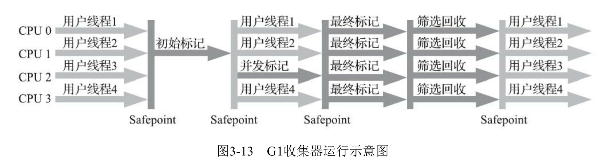
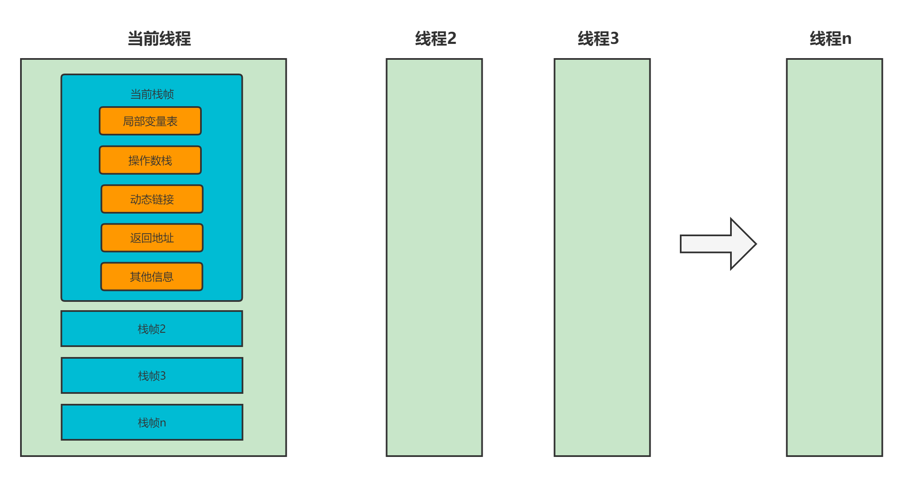

JVM

### 1.对象的内存布局是什么样子？

>对象在堆内存中的存储布局可以划分3个部分，对象头，实例数据，对齐填充。
>
>对象头包括两个部分，
>
>第一是对象的运行时数据，如对象哈希码，GC分代年龄，锁状态等，这部分称作Mark Word。
>
>第二是类型指针，java通过类型指针确定该对象属于那个类，如果对象是一个数组，那么对象头还必须有一块用于记录数组长度的数据。

Mark Word信息如下：

| 存储内容                             | 标志位 | 锁状态             |
| ------------------------------------ | ------ | ------------------ |
| 对象哈希码、对象分代年龄             | 01     | 未锁定             |
| 指向锁记录的指针                     | 00     | 轻量级锁定         |
| 指向重量级锁的指针                   | 10     | 膨胀（重量级锁定） |
| 空                                   | 11     | GC标志             |
| 偏向线程ID、偏向时间戳、对象分代年龄 | 01     | 可偏向             |

> 32位虚拟机mark word


> 64位虚拟机mark word


### 2. Object obj=new Object()占了多少个字节？

> jvm默认开启了指针压缩，这个占用16字节


### 3.什么是缓存行？

> cpu处理数据的时候，会先从一级缓存去取，如果没有就从二级缓存中找，在没有就从三级缓存，还没有，那么就从内存中读取，但是不会只单单读取需要处理的数据，而是会读取一个64字节的块，因为CPU认为处理完这个数据大概率也会处理他相邻的数据，而这个块就是cache line。

### 4.什么是缓存一致性协议？

> 首先说缓存的一致性问题，假设有两个CPU同时拿到了主内存的同一份数据A，假设A初始数据是0，cpu 0给A加1后写回主内存，此时cpu 1并不知道A被修改了，所以它也修改了A数据，让A加1后写回主内存，最终A的数据是1，正确的数据应该是2，此时就出现了缓存不一致的问题。
>
> 为了解决这个问题，CPU提供了两种方案
>
> 1.总线锁
>
> 在多cpu情况下，某个cpu对共享数据操作时，在总线上发出一个lock信号，总线把CPU和内存之间的通信锁住，其他CPU不能操作此内存地址的数据。
>
> 2.缓存锁
>
> 降低了锁的粒度，基于缓存一致性来实现。
>
> 第一个锁总线，开销大，性能低，所有后来提供了一种优化，就是缓存一致性协议。
>
> 缓存锁的实现之一，也叫MESI协议。MESI是以缓存行（缓存的基本单位，64 KB）的几个状态来命名的。该协议要求每个缓存行都维护一个状态，就是下面这四个状态之一。
>
> Modify 修改过的，处于此状态的数据，只有本CPU中有缓存数据，其他CPU没有，同时其状态表示相对于内存的中值来说，是修改过的，且没有更新到内存中。
>
> Exclusive 独占，处于这个状态的数据，只有本CPU中有缓存数据，其他CPU没有，同时其状态表示和内存中数据一致。没有被更改过。
>
> Shared 共享，处于这个状态的数据，多个CPU都有缓存数据，并且缓存数据没有被更改，都与内存中一致。
>
> Invalid 失效，表示本CPU的数据无效了。
>
> 数据总线嗅探机制：
>
> 一个初始M状态的缓存行会时刻监听所有试图读取该缓存行对应主存地址的数据，如果监听到，则在其他CPU操作之前，把数据刷回主存。
>
> 一个处于S状态的缓存行会时刻监听该缓存行无效或者独享该缓存的请求，如果监听到，则必须把缓存行设置为I（无效）。
>
> 一个处于E状态的缓存行会时刻监听其他试图读取该缓存行对应的主存地址的操作，如果监听到，则必须把缓存状态行设置成S。
>
> 当CPU需要读取数据时，如果其缓存行状态是I，则需要从主存中读取，如果不是I，则直接可以读取缓存中的值。
>
> 当CPU需要写数据时，只有在缓存行时E或者M的状态下才能执行，否者需要发出RFO（Read Or Ownership总线事务）指令，通知其他CPU将缓存设置为无效。在写入完成后，在修改状态为M。
>
> 并非所有的情况都是用MESI协议，如被操作的数据跨越多个缓存行，或者CPU不支持的时候，则是总线锁。


### 5.HotSpot的算法细节实现？

#### 5.1根节点枚举

> 可达性分析算法中，是以GC Roots 为根节点，向下寻找引用关系的。GC Roots 主要是全局的引用（常量和类静态变量）和执行上下文（栈帧中的本地变量表中），虽然定义比较明确，但是java越来越庞大，设计扫描的空间甚至高达几个G，如果一个个的检查，这一步会消耗很多时间，所有的收集器在这一步都是在暂停用户线程的，但是查找引用链可以和用户一起并发执行。HotSpot虚拟机中，当类加载完成之后，虚拟机就会将对象在什么偏移量上记录着什么类型的数据计算出来，然后把计算出来的数据放入OopMap（普通对象指针映射）的数据结构中。另外一部分，在即时编译过程中会在**特定的位置**记录下栈和寄存器中那些位置是引用，然后放入OopMap中去，这样以来收集器就可以直接得到这个GC ROOTS的信息了，而不需要一个个扫描。

#### 5.2安全点（Safepoint）

> 找到GC ROOTS很容易，但是由于用户线程仍然活动导致引用关系发生变法，所以oopmap的内容变化的指令非常多，如果为每个指令都维护一个oopmap，占用空间会很大。刚才说的特殊的位置，这些地方被成为安全点，这些安全点就说明不是用户线程随时都可以停下来，而是强制要求必须执行到安全点才能够暂停，所以安全点的选择就变得重要，不能太少也不能太过频繁。
>
> **安全点选定为长时间执行的指令**，例如：方法调用，循环跳转，异常跳转等属于指令序列复用，所以具有这些功能的指令才会产生安全点。
>
> 垃圾回收的时候，需要让所有线程都跑到最近的安全点，然后停下来。这里又两种解决方案：
>
> 1. 抢先式中断
>
>    垃圾回收的时候，系统先把所有的用户线程全部中断，然后如果发现有线程不在安全点上，在恢复这些线程，知道跑到安全点在重新中断，大部分虚拟机不用这个方法
>
> 2. **主动式中断**
>
>    设置一个标志位，用户线程执行过程中主动轮询标志位，一旦发现中断标志位是真，则跑到最近的安全点，然后主动中断自己。
>
>    因为轮询会反复出现，所以要求高效，HotSpot使用内存保护陷阱的方式，把轮询操作精简成一条汇编指令。

#### 5.3安全区域（Safe Region）

> 安全点只能解决那种正在执行的线程，但是那些没有分配到时间片，还有等待阻塞的线程是无法解决的。
>
> 安全区域是指确定在某一点代码中，引用关系不会变法，因此在这个区域中任何开始垃圾回收都是安全的，也可以叫做安全点的拉伸。

#### 5.4记忆集和卡表

> 记忆集是一种用于记录从非收集区域指向收集区域的指针集合的**抽象**数据结构。实现方式：
>
> 1. 字长精度
>
>    每个记录精确到一个机器字长。
>
> 2. 对象精度
>
>    每个记录精确到一个对象，这个对象有跨代指针。
>
> 3. 卡精度
>
>    每个记录精确到一块内存区域。这个区域有对象包含跨代指针。
>
> 卡精度是使用卡表实现的。Card Table都对应这个一个内存块（叫做卡页），一个卡页在HotSpot虚拟机总占用512KB。
>
> 如果一个卡页中有一个或者多个对象包含跨代引用，就把卡表元素设置成1，表示变脏。否则标识成0。

#### 5.5写屏障

> 这个要和CPU指令的读写屏障区分开，这个是位了维护卡表的元素。利用AOP，CMS使用写后屏障，G1使用环绕屏障。

#### 5.6并发的可达性分析

> 并发标记可能会出现对象消失的问题，这个问题只影响CMS和G1，因为他们的并发标记阶段是和用户线程并发执行的，有两种方案可以解决，问题分别是：
>
> 1. 赋值器插入了一条或者多条从黑色对象到白色对象的薪引用。
> 2. 赋值器删除了全部从灰色对象到白色对象的直接或间接引用。
>
> 解决方案：
>
> 1. 增量更新（CMS的解决方案）
>
>    增量更新破环的是第一条，当黑色对象插入白色对象的引用关系时，就将这个插入引用记录下来，等扫描结束后，就以这些黑色对象为根重新扫一次，这样可以理解成黑色对象一旦插入了指向白色对象的引用后，它就变成灰色的啦。
>
> 2. 原始快照（G1的解决方案）
>
>    原始快照破环的是第二个条件，当灰色对象要删除指向白色对象的引用关系时，将这个要删除的引用记录下来，扫描结束之后，再将记录的引用关系中的灰色为跟重新扫描。这样可以理解为，无论是否删除引用关系，都会按照刚刚扫描的对象图快照开重新搜索。
>
> 无论插入或者删除引用关系，都是通过虚拟机的写屏障来实现。

### 6. 垃圾回收算法有哪些？

#### 1.标记-清除


#### 2.标记-整理


#### 3.标记-复制


#### 4.分代算法

> 分代算法没有新的概念，而是再老年代和新生代用以上不同的算法组合。

### 7. 垃圾回收器有哪些，它们是如何工作的？

##### 垃圾回收器配合图：


#### 1. Serial(单线程新生代收集器)


> Serial是一个单线程新生代的垃圾收集器，也是最早产生的，它的意义不单单是单线程，更重要的是强调它在进行垃圾收集时，必须暂停其他工作线程，即“Stop The World”，其回收算法使用标记复制算法，它的老年代版本时Serial Old,使用标记-整理算法。虽然现在有很多高效的收集器出现，但它依然没有被淘汰，在单核处理器和客户端的应用中依然使用。

#### 2. ParNew收集器


> ParNew收集器可以看成时Serial收集器的多线程版本，JDK 1.7之前首选的新生代垃圾回收器。之所以首选是因为除了Serial之外，只有它可以和CMS配合工作，单核心处理器环境中，性能不会比Serial强，而且还多了线程交互的开销。激活CMS（-XX: +useConcMarkSweepGC）后，默认收集器，当然也可以通过-XX：+/-UseParNewGC来强制使用或者禁用它。JDK 1.9之后取消和serial Old 的搭配。

#### 3.Parallel Scavenge(并行收集器)

> 新生代并行收集的多线程收集器，也叫吞吐量优先收集器，同样使用标记-复制算法，表面上与ParNew很相似，它的特点是关注点和其他收集器不同，CMS关注的是尽可能的缩短垃圾回收时用户线程的停顿时间。而Parallel Scavenge收集器关注的是可控的吞吐量。高吞吐量可以最高效的利用处理器完成程序的运算任务，适合后台运算而不需要太多用户交互的进程。


> Parallel Scavenge收集器有两个参数可以精确控制吞入量。
>
> -XX:MaxGCPauseMillis
>
> 参数允许一个大于0的毫秒数，收集器将尽量保证回收花费的时间小于用户设定值，但是缩短垃圾时间是以牺牲吞吐量和新生代空间为代价的，收集100M空间的内存肯定比收集300M的内存更快，但是虽然垃圾收集时间减少了，但是收集次数变多了。吞吐量也就下来了。
>
> -XX:GCTimeRatio
>
> 参数允许一个0-100的整数，表示垃圾收集时间的比例，相当如吞吐量的倒数，如果是19，则1/(1+19)=5%,表示允许最大垃圾回收时间占总时间的5%。
>
> 另外还有说一个参数
>
> -XX:UseAdaptiveSizePolicy
>
> 这个参数表示自适应参数，就是不用指定新生代的大小，伊甸区和幸存者去的比例，进入来年代对象的阈值参数设计，虚拟机会根据情况自行设置，你只需要给它一个优化目标，参照前面说的两个参数。

#### 4.Serial Old收集器


> Serial收集器的老年代版本，同样是个单线程收集器，使用标记-整理算法。这个收集器主要也是给客户端模式下使用。服务端模式下，有两种情况使用：
>
> 1.JDK1.5及之前与Parallel Scavenge搭配使用。
>
> 2.作为CMS收集器发生失败时的预案，即并发收集发生Concurrent Mode Failure时使用。

#### 5.Parallel Old收集器


> Parallel Scavenge的老年代版本。支持多线程并发收集，基于标记-整理算法实现，JDK1.6开始提供。之前，Parallel Scavenge只能和Serial Old[1]配合使用，由于Serial Old是单线程收集器，所以再性能上Parallel肯定被拖累，无法在整体上获得最大吞吐量的结果，在老年代比较大的情况下，性能不如ParNew+CMS的组合。Parallel Old的出现，使得吞吐量收集器百年的名副其实。

##### **备注**：

> [1]：Parallel Scavenge内部实现了PS MarkSweep作为老年代收集器，由于PS MarkSweep和SerialOld基本一致，所以直接说时Serial Old,也没什么不妥。

#### 6.CMS收集器

> CMS(Concurrent Mark Sweep)收集器是以获取最短垃圾回收时间为目的的垃圾回收器，主要使用在互联网或者基于浏览器的B/S系统上，这类应用通常比较关注服务的响应速度。CMS收集器比较符合这类应用的需求。还有CMS可以单独清理老年代，其他收集器没有这个特点，只能触发整堆收集。
>
> CMS是基于标记-清除算法实现，运作比较复杂。要经过四个步骤：
>
> 1.**初始标记**（Stop The World）
>
> 2.并发标记
>
> 3.**重新标记**(Stop The World)
>
> 4.并发清除

##### 1.**初始标记**：

> 初始标记需要暂停用户线程，但是过程很快，只需要标记出GC Roots能直接关联的对象，单线程运行。

##### 2.并发标记：

> 并发标记就是在被初始标记的对象上开始遍历整个对象图的过程，这个过程耗时较长，但是不需要暂停用户线程。用户线程和垃圾回收线程并发运行。

##### 3.**重新标记**：

> 重新标记是为了修正并发标记期间，由于用户线程运作而导致标记产生变动的那一部分对象标记记录。此阶段比初始标记时间稍长，需要暂停用户线程。

##### 4.并发清除：

> 并发清除就是和用户线程同时运行，清除掉标记阶段判断已经死亡的对象。因为不需要移动存活对象，所以可以和用户线程一起并发执行。


> CMS收集器整个阶段并发标记和并发清除阶段耗时最长，但是可以和用户线程一起运行，所以CMS可以看作是和用户线程一起并发执行的收集器。

##### CMS收集器的缺点：

> **1.对处理器资源敏感:**
>
> 事实上所有面向高并发设计的程序都对处理器资源比较敏感，CMS并发阶段虽然不会暂停用户线程，但还是会占用一部分线程而导致用户线程变慢，降低吞吐量。CMS默认启动回收的线程说是(core+3)/4,假设处理器是4核，那么CMS将启动1个线程，占用不超过25%的回收线程，并且核心数越多，占用线程比例越低。但是当核心数小于4个时，如果应用本来负荷就高，还需要分出一半的线程执行垃圾回收，这就有可能导致用户程序的执行速度大幅度降低。为了缓解这种情况，虚拟机提供了一种成为*增量式并发收集器*的CMS收集器的变种。原理是抢占式多任务来模拟多核并行多任务的思想，在并发标记和并发清理的时候和用户线程交替进行。但这样会使整个垃圾回收的时间变得更长，对用户程序的影响边的少一点，但是总的影响时间变得更长，只是速度下降没有那么明显。JDK1.7的时候已经把这个变种标记成过时，JDK1.9的时候，这个变种彻底弃用。
>
> **2.产生浮动垃圾：**
>
> 在CMS的并发标记和并发清除阶段，用户线程还在执行，那么自然就会伴随着新的垃圾对象不断产生，但是这部分垃圾对象使在并发标记以后出现的，所以只能能带下次垃圾回收时在回收，这部分垃圾对象叫做**浮动垃圾**，
>
> 同样在并发标记和并发清除阶段，用户线程还在执行，CMS不像其他收集器一样等老年代几乎满了才开始回收。这就需留有足够的空间内存给用户线程使用。JDK5默认68%，但是也提供了一个参数（-XX：CMSInitiatingOccu-pancyFraction）来调整CMS触发回收的百分比。JDK1.6默认提升到92%，但是这又面临另一种风险在CMS并发期间预留的内存不够分配给用户线程产生的新对象，导致**并发失败**，虚拟机只能只能备用方案，暂时暂停用户线程，临时启用Serial Old收集器重新进行垃圾收集，这样一来，停顿的时间更长了。
>
> **3.产生大量空间碎片：**
>
> CMS收集器是基于标记-清除算法实现的，这就意味着收集结束后会有大量的空间碎片产生。空间碎片过多时，会导致老年代明明还有很多剩余空间，但是没办法找到连续空间来分配当前对象。这样就不得不触发FULL GC，为了解决这个问题CMS提供了一个参数（-XX：+UseCMS-CompactAtFullCollection），默认开启（JDK9 开始作废），表示在CMS收集器不得不进行FULL GC时开启内存碎片整理，碎片整理会移动对象，所以会暂停用户线程，导致停顿时间变的更长。因此虚拟机又提供了另外一个参数（-XX：CMSFullGCsBeforeCompaction）默认0，作用时要求CMS收集器在执行若干次标记清除式的FULL GC后，在下一次FULL GC之前会先进行垃圾碎片整理。

#### 7.G1收集器



> G1整体上使用化整为零的思想，将整个堆分成了连续的Region,每个region可以自己设置，最大32MB最小1MB，必须是2的n次幂。G1的特点是可预测的停顿时间模型，就是用户可以设置希望的停顿时间，因为G1回收的块是一个Region的整数倍，所以它可以分析出各个Region所能回收的价值，即回收所获得的空间大小以及回收所需要的时间的经验值。


> 每个Region都可以根据需要扮演新生代的伊甸区，幸存者区，或者老年代。还有一个区域叫做Humongous Region专门存放大对象，大对象是指大小超过了一半的region容量的对象，如果超过了一个region容量，就放在连续的Humongous中，一般情况下，humongous也可以看做老年代，清除算法从整个堆来说，是基于标记-整理的，基于每个Region来说是基于标记-复制的。

### 8. 什么是逃逸分析？

> 先说说什么是逃逸：
>
> 1. 方法逃逸
>
>    当一个对象在方法中被定义后，它可能被外部方法所引用，例如作为参数传到其他方法中，这种成为方法逃逸。
>
> 2. 线程逃逸
>
>    如果上面的对象赋值给其他线程所访问的实例变量，这种成为线程逃逸。
>
> 如果能证明一个对象不会逃逸出方法或者线程之外，或者逃逸程度比较低，则可能为这个对象实施不同程度的优化：
>
> 1. 栈上分配
>
>    如果只会发生方法逃逸的对象，确定不会逃出线程之外，可以采用栈上分配的方式，让对象随着方法的出栈而消亡。垃圾收集子系统的压力也会减少很多。
>
> 2. 标量替换
>
>    一个能在进行分解的数据成为标量，比如基本类型（int  long reference等），如果一个数据可以继续拆分，这个数据就被成为聚合量。如果把一个java对象拆解，根据程序访问的情况，把用到的成员变量恢复为原始类型来访问，这个过程成为标量替换。
>
>    如果逃逸分析这个对象不会逃逸出方法，并且也可以被拆解，那么程序真正执行的时候，可能不会创建这个对象，而是创建这个对象的若干个能被这个方法访问的成员变量来代替。标量替换可以看作是栈上分配的一种特例。
>
> 3. 同步消除
>
>    线程同步比较耗时，如果逃逸分析能够分析出一个对象不会逃逸出线程，无法被其他线程访问，那么这个线程的同步就不会有竞争，对这个变量实施的同步措施就可以安全的消除。
>
> java虚拟机采用的是不那么精确时间压力较小的算法来完成，因为如果要精确的分析，计算成本非常高，不能保证逃逸分析带来的收益会高于它的消耗。

### 9. 锁优化有哪些？

#### 9.1自旋锁和自适应自旋

> 1. 自旋
>
> 互斥同步对性能影响最大的是阻塞的实现，挂起线程和恢复线程的操作都需要转到内核态中完成，这就为并发性能带来了很大的压力，而且很多应用中，共享数据的锁定只会持续很短的一段时间，为了这点时间去挂起和恢复线程并不值得，而且现在都是多核处理器，可以让多个线程并行执行，如果一个线程没有获取到锁，可以让这个线程稍等一下，不放弃CPU的处理时间，让这个线程执行一个忙循环，这个技术就是自旋。
>
> 2. 自适应自旋
>
> 他的自旋次数不是固定的，如果线程上次自旋某个锁成功了，那么这次自旋的次数会有所增加，虚拟机认为既然上次成功了，那么这次也极有可能成功，反之，如果某个锁很少有自旋成功的，那么以后自旋的次数会减少，甚至省略掉自旋的过程，以免浪费资源。

#### 9.2锁消除

> 锁消除的主要判定是来源于逃逸分析的支持，如果判断一段代码中在堆上的所有对象都不会逃逸，或者被其他线程访问到，那就可以把它当成栈上的数据对待，认为是线程私有的，同步锁自然就无需进行啦。

#### 9.3锁粗化

> 如果一系列的操作都是对同一个对象加锁和解锁，甚至在循环中加锁，那么就算没有线程操作，频繁的进行互斥操作也会导致不必要的性能损耗。虚拟机如果检测到有这样的操作，会将锁的范围扩大，比如循环外面，或者在连续加锁的代码的两端。

#### 9.4轻量级锁

> 当一个线程在即将进入同步代码块的时候，如果锁对象没有没锁定（锁标志位01），虚拟机就会在当前线程的栈帧中建立一个叫锁记录(Lock Record)的空间，用于存储锁对象markword的拷贝，然后虚拟机将使用CAS操作将对象的markword更新为指向当前线程的锁记录指针，如果更新动作成功，则将锁对象的标志位更新为轻量级锁定(00)。
>
> 有两种情况，轻量级锁会膨胀为重量级锁：
>
> 1. 当有线程CAS自旋超过最大次数，仍然没有获取到锁的时候。
> 2. 当竞争线程数大于cpu核数的一半时。

#### 9.5偏向锁

> 偏向锁，就是偏袒一个线程的锁，当一个线程持有偏向锁，那么它再次请求锁资源时候，只要发现对象头的线程ID是自己，就可以直接进入进入加锁代码。目的是消除无竞争情况下的同步原语，进一步提高程序的运行性能。轻量级锁在无竞争的情况下使用CAS消除同步使用的互斥量。偏向锁是在无竞争的情况下把整个同步都消除掉，连CAS都不用做。

##### 偏向锁的过程如下：

> 1.当锁对象第一次被一个线程获取的时候，虚拟机会把对象头标志位设置为01，偏向模式设置为1，表示进入是偏向模式。同时使用CAS操作，把获取到锁的线程ID记录在锁对象的mark word中。如果CAS操作成功，持有偏向锁的线程以后每次进入这个锁相关的同步块时，虚拟机都不会在进行同步操作。
>
> 2.这个时候，一旦有另外一个线程尝试获取锁，偏向模式马上结束，然后根据对象是否被锁定的状态决定是否撤销偏向（偏向模式设置为0），撤销后标志位恢复到未锁定或者轻量级锁定。后续的同步操作根据轻量级锁的规则去处理。


### 10. jvm运行时内存布局？


> 虚拟机栈如下：



> **局部变量表：**
>
> 基本数据类型和引用
>
> **操作数栈：**
>
> 是一个先入后出的栈，64位系统的栈容量是2，作用是不断的存储指令的每一行运算的结果，以及运算过程中需要的参数。操作数栈中元素的数据类型必须与字节码指令的序列严格匹配。
>
> **动态链接：**
>
> 每个栈帧都包含一个指向运行时常量池中该栈帧所属方法的引用。
>
> Class文件的常量池中存有大量的符号引用，字节码中的方法调用指令就以常量池里指向方法的符号引用作为参数。这些符号 引用一部分会在类加载阶段或者第一次使用的时候就被转化为直接引用，这种转化被称为静态解析。另外一部分将在每一次运行期间都转化为直接引用，这部分就称为动态连接。
>
> 但是被重载的方法，比如多态，这个只有在运行期间才能转化成直接引用，这部分就是动态链接。
>
> **方法返回地址：**
>
> 当一个方法开始执行后，只有两种方式退出这个方法。
>
> 第一种方式是执行引擎遇到任意一个方法返回的字节码指令，这时候可能会有返回值传递给上层的方法调用者。
>
> 另外一种退出方式是在方法执行的过程中遇到了异常，并且这个异常没有在方法体内得到妥善处理。无论采用何种退出方式，在方法退出之后，都必须返回到最初方法被调用时的位置，程序才能继续执行。方法退出的过程实际上等同于把当前栈帧出栈。

### 11.类加载机制

> java虚拟机把Class文件加载到内存，并对数据进行校验，转换解析和初始化，最终形成可以被虚拟机直接使用的java类型，这个过程叫做类加载机制。


#### 11.1类加载的时机

> 对于什么时候加载，java规范没有进行强制约束，但是对初始化有严格的约束，只有下面六种情况，而加载、验证和准备都在在初始化之前开始。下面时初始化的时机：
>
> 1.遇到new、 getstatic、 putstatic、 invokestatic这四个字节码指令时。
>
>  1.1 使用new关键字实例化对象的时候。
>
>  1.2 读取或者设置一个类的静态变量的时候（被final修饰，已在编译器把结果放入常量池的静态变量除外）。
>
>  1.3 调用一个类型的静态方法时。
>
> 2.使用java.lang.reflect包的方法对类型进行反射的时候，如果类型没有进行过初始化，则需要先触发其初始化。
>
> 3.当初始化类的时候，如果发现其父类还没有进行初始化，则需要先触发其父类的初始化。
>
> 4.当虚拟机启动时，用户需要指定一个要执行的主类（包含main方法的那个类），虚拟机会先初始化这个主类。
>
> 5.当使用JDK7新加入的动态语言支持时，如果一个java.lang.invoke.MethodHandle实例的最后解析结果REF_getstatic,REF_putstatic,REF_invokestatic,REF_newInvokeSpecial四种类型方法的句柄，并且这四个方法句柄对象没有进行过初始化，则需要先触发其初始化。
>
> 6.当一个接口定义了JDK8新加入的默认方法（被default关键字修饰的接口方法）时，如果有这个接口的实现类发生了初始化，那该接口要在之前初始化。

#### 11.2类加载过程

> 类加载过程包括加载，验证，准备、解析和初始化五个阶段所执行的具体动作。

##### 11.2.1 加载

> 加载阶段需要完成下面三件事：
>
> 1.通过一个类的全限定名来获取定义此类的二进制流。
>
> 2.将这个二进制流所代表的静态存储结构转化为方法区的运行时数据结构。
>
> 3.在内存生成一个代表这个类的java.lang.Class对象，作为方法区的各中数据的访问入口。
>
> 注：由于java虚拟机规范没有限制要从哪里获取二进制流，虚拟机就有多种花样进行获取：
>
> 1.从jar、war、Ear格式的压缩包获取
>
> 2.从网络中获取，例如：Web Applet。
>
> 3.运行时生成，比如动态代理技术。
>
> 4.其他文件中生成，比如JSP。
>
> 5.从数据库读取：某些中间件服务器如:SAP Netweaver。
>
> 6.从加密文件中获取，主要是保护程序逻辑不被窥探。

##### 11.2.2 验证

> 验证时为了确保Class文件字节流包含的信息符合JAVA虚拟机规范的全部约束。保证这些信息不会危害虚拟机自身的安全。
>
> 1.文件格式验证
>
> 2.元素据验证
>
>   2.1类是否有父类
>
>   2.2类是否继承了不被允许继承的类
>
>   2.3如果这个类不是抽象类，是否实现了父类或者接口中要求实现的全部方法。
>
>   2.4类中的字段，方法是否与父类发生矛盾。
>
> 3.字节码验证
>
>   主要是验证语义。
>
> 4.符号引用验证
>
>   符号引用中通过字符串描述符的全限定名是否能找到对应的类。
>
>   在指定类中是否能找到符合方法的字段描述符及简单名称所描述的方法和字段。
>
>   符号引用中的类、字段和方法的可访问性是否可被当前类访问。
>
>   符号引用的验证主要目的是保证解析行为能正常执行，如果符号引用不通过，则会抛出异常，比如：
>
>   java.lang.IllegalAccessError、java.lang.NoSuchFieldError、java.lang.NoSuchMethodError等。

##### 11.2.3 准备

> 准备阶段是正式为类中定义的静态变量分配内存并赋初始值的阶段，基本数据类型赋值为0，引用类型赋值为null。
>
> 在准备阶段，分配内存的只包括静态变量，不包含实例变量。

##### 11.2.4 解析

> 解析阶段是java虚拟机将常量池内的符号引用替换为直接引用的过程。
>
> 符号引用：以一组符号来描述所引用的目标，符号可以是任何形式的字面量，只要使用时能无歧义的找到目标即可。
>
> 直接引用：直接引用是可以直接指向目标的指针、相对偏移量或者能间接定位目标的句柄。
>
> 解析包括：
>
> 1. 类或接口的解析
> 2. 字段的解析
> 3. 方法解析
> 4. 接口方法解析

#### 11.2.5 初始化

> 根据程序员编写的赋值，为在准备阶段赋过初始值的变量设置指定值。初始化阶段就是执行类的构造器<clinit>方法的过程。

#### 11.3类加载器

> 在类加载阶段，虚拟机把**通过一个类的全限定名来获取一个类的二进制流**这个动作放在虚拟机外部实现，以便让程序员自己决定如何去获取所需的类。实现这个动作的代码叫做类加载器。

##### 11.3.1 双亲委派模型

> 在java虚拟机的角度看，一共有两种类加载器
>
> 1. 启动类加载器(bootstrap classload)：C++实现
> 2. 其他所有的类加载器：java实现


> 工作过程：
>
> 如果一个类加载器收到一个类加载的请求，它首先不会自己加载，而是委派给父类去加载，如果父类还有父类，继续委派，当父类在搜索范围内找到该类，就进行加载，如果找不到，就有子加载器尝试自己加载。好处是确保一个类只被一个类加载器加载。

### 12.为什么java程序运行时间越长速度就越快？

> jvm一般都是用混合模式，即解释器和编译器同时工作，对于热点代码，编译器会将其优化后变成本地代码。
>
> 解释器和编译器两者各有优势：
>
> 当程序需要快速启动和执行的时候，解释器首先发挥作用，省去了编译的时间，立即运行。随着时间的推移，当编译器逐渐发挥作用，把越来越多的代码编译成本地代码，这样可以减少解释器的中间损耗，获得更高的执行效率。

#### JIT(just-in-time)即时编译器的优化

##### 1.方法内联

> 将方法调用直接使用方法体内的代码进行替换，减少方法调用过程中压栈与出栈的开销。例如当JVM监测到一些小方法被频繁执行，它就会把方法的调用替换成方法体本身。

##### 2.逃逸分析

> 此文档已经有说明，简单说一下
>
> 1. 栈上分配
> 2. 标量替换
> 3. 同步消除

##### 3.公共子表达式的消除

> 如果一个表达式E之前以前被计算过了，并且从先前的计算到现在E中所有变量的值都没有发生变化，那么E的这次出现就被成为公共子表达式。对于这种表达式，没有必要花时间再对他重新计算，只需要前面使用计算结果代替E即可。下面看一个例子：

```java
int d = (c * b) * 12 + a + (a + b * c);
```

> 如果这段代码交给javac编译器，则不会有任何变化，完全按照java源码的写法直译过来，如：

```properties
0: iload_3
1: iload_2
2: imul
3: bipush        12
5: imul
6: iload_1
7: iadd
8: iload_1
9: iload_2
10: iload_3
11: imul
12: iadd
13: iadd
14: istore        4
```

> 当使用即使编译器，由于b*c已经计算过了，所以会如下计算：

```java
int d = E * 12 + a + (a + E);
//如果是服务端编译器还可能会进一步优化，代数优化
int d = E * 13 + a + a;
```

##### 4.数组边界检查消除

> 如果有一个数组foo[]，在java语言中访问数组元素foo[i]的时候，系统将会自动检查上下界的范围检查，即i必须满足"i>=0&&i<foo.length"这个条件，否者抛出数据越界异常。对于大量数组访问的代码，这无疑使一种性能负担。
>
> 为了安全起见，这种检查必须要做，但是不是需要一次不漏的去做，这就不一定了，例如对于访问foo[3]，只要在编译期间根据数据流分析来确定foo.length的值，并判断下标3有没有越界，执行的时候就没有必要判断了。
>
> 另一种情况是数据访问发生在循环体内，并且使用循环变量来进行数组的访问。编译器只要通过数据流分析就可判定循环变量的取值是否永远都在[0,foo.length]之间，如果是，那么在循环种就可以把整个数组的上下界检查消除掉。

##### 5.指令重排序

> 编译器、JVM 或者 CPU 都由可能在保证单线程的语义的前提下对于实际指令执行的顺序进行调整，这就是重排序。
>
> 目的是为了尽可能减少寄存器的读取，存储次数，充分复用寄存器的存储值，以达到提高处理速度的结果。

### 13.如何判断对象是死亡？

> 1.引用技术算法
>
> 在对象里加入一个引用计数器，每当有一个地方引用它是，计数器值就加1，当引用失效时，计数器就减1，当计数器为0的时候，就是对象不再使用了，可以回收了，这个看似不错的算法，在主流的java虚拟机中并没有使用，因为如果对象相互引用，那么它就没办法被回收了。
>
> 2.**可达性分析算法**
>
> 这个算法的思路是通过一系列称为“GC ROOTS”的根对象作为起始节点，从这些节点开始，根据引用关系向下搜索，搜索过程所走过的路径成为“引用链(Reference chain)”，如果某个对象到GC ROOTS没有任何引用链相连，那么就称这个对象不可达，可以回收了。

#### 1. GC ROOTS的对象包括哪些呢？

> 1.虚拟机栈中的本地变量表所引用的对象
>
> 2.类静态变量所引用的对象
>
> 3.常量引用的对象，比如字符串常量池里面的引用。
>
> 4.在本地方法栈中JNI（就是native方法）所引用的对象。
>
> 5.虚拟机内部的引用，如基本类型对象的Class对象，一些常驻的异常对象，如：NullPointException、OutOfMemoryError等，还有系统类加载器。
>
> 6.所有被synchronized持有的对象。
>
> 7.反应虚拟机内部情况的JMXBean、JVMTi中注册的回调，还有本地代码缓存等。

### 14.对象的引用类型有哪些？有什么特点？

> 1. 强引用（Strongly Re-ference）
>
>    类似“Object obj=new Object()”这种引用关系。无论任何情况下，只要强引用关系还存在，垃圾收集器就永远不会回
>    收掉被引用的对象。
>
> 2. 软引用（Soft Reference）
>
>    用来描述一些还有用，但非必须的对象。只被软引用关联着的对象，在系统将要发生内存溢出异常前，会把这些对象列进回收范围之中进行第二次回收，如果这次回收还没有足够的内存，才会抛出内存溢出异常。(比如缓存)
>
> 3. 弱引用（Weak Reference）
>
>    也是用来描述那些非必须对象，但是它的强度比软引用更弱一些，被弱引用关联的对象只能生存到下一次垃圾收集发生为止。当垃圾收集器开始工作，无论当前内存是否足够，都会回收掉只被弱引用关联的对象。（ThreadLocal）
>
> 4. 虚引用（幽灵引用Phantom Reference）
>
>    一个对象是否有虚引用的存在，完全不会对其生存时间构成影响，也无法通过虚引用来取得一个对象实例。为一个对象设置虚引用关联的唯一目的只是为了能在这个对象被收集器回收时收到一个系统通知。

### 15.对象的访问定位？

> 1.句柄
>
> 2.直接指针

###### 备注：下面两个图片的方法区已经不在存在，应该叫做元空间。


> 两者各有优缺点
>
> 1.句柄：
>
> reference存的是稳定的句柄地址，在对象被移动时只会改变句柄中实例对象数据指针，而reference本身不需要改变。但是访问对象数据需要两次定位。
>
> 2.直接指针：
>
> 因为节省了一次指针定位，所以访问速度更快。针对主流java虚拟机，比如HotSpot而言，主要使用直接指针的方式。（也有例外：使用Shenandoah收集器的话，也会有一次额外的转发）

### 16. java虚拟机栈会抛出什么异常？

> 1. StackOverflowError:
>
>    线程请求的栈深度大于虚拟机所允许的最大深度会抛出此异常。
>
>    栈深度其实就是栈帧的数量，也是方法的调用数量，一种情况是栈帧过多，达到了栈的最大容量，另一种是在方法栈中定义了大量的本地变量，使栈超出最大容量。
>
> 2. OutOfMemoryError:
>
>    如果虚拟机栈内存允许扩展，当扩展栈容量无法申请到足够的内存时，会抛出此异常，但是HotSpot虚拟机是不支持扩展的，所以只有在创建线程在申请内存时无法获取足够的内存才抛出此异常，否则在运行时只可能抛出StackOverflowError异常。
>
> 3. 通过-Xss可以设置栈内存。

### 17. 分代收集理论

> 1. 弱分代假说：绝大多数对象都是朝生夕灭的。
>
> 2. 强分代假说：熬过越多次垃圾收集过程的对象，就越难以消亡。
>
> 3. 跨代引用假说：跨代引用相对于同代引用占极少数。
>
>    在新生代上建立一个数据结构（记忆集 Remembered Set），这个结构把老年代化成若干小块，标识出老年代的哪一块会存在跨代引用，此后在发生Minor GC的时候，只有包含了跨代引用的小块内存里的对象才会被加入到GC ROOTS进行扫描。

### 18. GC类型名称

> 1. 新生代收集(Minor GC/Young GC)：新生代的垃圾收集。
> 2. 老年代收集(Major GC/Old GC)：老年代的垃圾收集，目前只有CMS收集器会有单独的老年代收集器。如果不是用的CMS收集器，会叫整堆收集。
> 3. 混合收集器(Mixed GC)：收集整个新生代和部分老年代。目前只有G1收集器支持。
> 4. 整堆收集(Full GC)：收集整个java堆和方法区（元空间）。

### 19. 一般项目配置那么jvm参数

| 配置项                           | 含义                         |
| -------------------------------- | ---------------------------- |
| -Xms4g                           | 堆最小内存                   |
| -Xmx4g                           | 堆最大内存                   |
| -XX:MetaspaceSize=64m            | 初始元空间大小               |
| -XX:MaxMetaspaceSize=256m        | 最大元空间大小               |
| -Xss256k                         | 栈大小默认1MB                |
| -XX:MaxDirectMemorySize=1g       | 最大直接内存                 |
| xloggc:/path/gc.log              | gc日志的目录                 |
| -XX:HeapDumpOnOutOfMemoryError   | jvm发生OOM时自动生成dump文件 |
| -XX:HeapDumpPath=/path           | dump文件路径                 |
| -XX:newSize                      | 初始新生代大小               |
| -XX:MaxNewSizde                  | 最大新生代大小               |
| -Xmn                             | 固定新生代大小               |
| -XX:Error=/path/hs_err_pid%p.log | jvm错误日志                  |

### 20.java内存模型

> java内存模型主要目的是为了高效并发而定义程序种各种变量的访问规则，即关注在虚拟机中把变量值存储到内存和从内存中取出变量值这样的底层细节。这里的**变量**值是指实例字段，静态字段，和构成数组对象的元素，不包括局部变量和方法参数，因为这部分是是线程私有的不会被共享，自然不会存在竞争问题。

#### 20.1 工作内存与主内存

> java内存模型规定所有的变量都存储在主内存中，每条线程还有自己的工作内存，线程的工作内存保存了该线程使用的变量的主内存副本。线程对变量的所有操作都必须在工作内存中进行。下图是线程、主内存和工作内存三者的交互关系：


#### 20.2 内存间交互操作

> 工作内存的交互协议，即一个变量如何从主内存拷贝到工作内存，如何从工作内存同步为主内存这样的底层细节。
>
> **lock**： 锁定
>
> 作用于主内存的变量，它把一个变量标识为一条线程独占的状态
>
> **unlock**:：解锁
>
> 作用于主内存的变量，它把一个处于锁定的变量释放出来，释放后的变量才可以被其他线程锁定
>
> **read**：读取
>
> 作用于主内存的变量，它把一个变量的值从主内存传输到线程的工作内存中，以便随后的load动作使用。
>
> **load**：载入
>
> 作用于工作内存的变量，它把read操作从主内存中得到的变量值放入工作内存的变量副本中。
>
> **store**：存储
>
> 作用于工作内存的变量，它把工作内存中一个变量的值传送到主内存中，以便随后的write操作使用。
>
> **write**：写入
>
> 作用于主内存的变量，它把store操作从工作内存中得到的变量的值放入主内存的变量中。
>
> 如果要把一个变量从主内存拷贝到工作内存，那就要按顺序执行read和load操作，如果要把变量从工作内存同步回主内存，就要按顺序执行store和write操作。
>
> 不允许read和load、store和write操作之一单独出现，即不允许一个变量从主内存读取了但工作内存不接受，或者工作内存发起回写了但主内存不接受的情况出现。
>
> **注意：**
>
> Java内存模型只要求上述两个操作必须按顺序执行，但不要求是连续执行。也就是说read与load之间、store与write之间是可插入其他指令
> 的。

#### 20.3 对于volatile修饰的变量的特殊规则

> 1. 保证变量对所有线程的可见性
> 2. 禁止指令重排序的优化

#### 20.4 原子性，可见性与有序性

> 可见性是指当一个线程修改了共享变量，其他线程可以立即得知这个修改。
>
> 1. 原子性
>
>    基本数据类型的访问读写都是原子性的，如果应用场景需要更大的原子性，可以使用synchronized关键字保证。
>
> 2. 可见性
>
>    volatile可以保证可见性；
>
>    synchronized和final也可以保证可见性；
>
>    同步块的可见性是由**对一个变量执行unlock操作之前，必须先把此变量同步回主内存中**这条规则获得。
>
>    被final修饰的字段在构造器中一旦被初始化完成，那么其他线程就能看见final的值。
>
> 3. 有序性
>
>    *如果在本线程内观察，所有的操作都是有序的；*
>
>    是指线程内似表现为串行的语义。
>
>    *如果在一个线程中观察另一个线程，所有的操作都是无序的。*
>
>    是指“指令重排序”现象和“工作内存与主内存同步延迟”现象
>
>    java语言使用volatile和synchronized保证了有序性。

#### 20.5 先行发生原则

>先行发生是Java内存模型中定义的两项操作之间的偏序关系，比如说操作A先行发生于操作B，其实就是说在发生操作B之前，操作A产生的影响能被操作B观察到，“影响”包括修改了内存中共享变量的值、发送了消息、调用了方法等。

### 21. CPU过高排查

```sh
#1.确定那个进程CPU过高
top
#2.找出CPU过高的线程ID
ps -mp pid -o THREAD,tid,time
#3.将找出的占用CPU过高的线程ID转换为16进制
printf '%x\n' tid
#4.根据16进制的tid过滤堆栈信息,下面的tid表示16进制 -A后面的数字表示行数
jstack -l pid |grep tid -A100
#5.查看堆栈信息，看是那个方法发生了引起的这个问题，再工程中去找。
```

