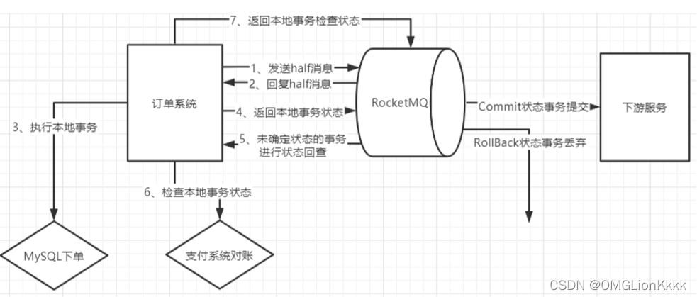
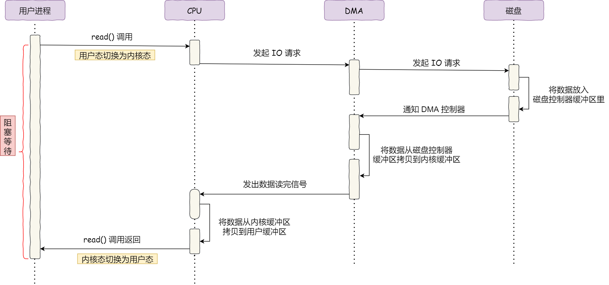

## RocketMQ

### 1.怎么保证消息不丢失？

> 生产者使用事务消息机制保证消息零丢失 。

### 2.怎么保重消息不会重复消费？

> 消息从生产者到broder再到消费者中，并不能保证消息不重复消费，虽然broder会记录消息的offset情况，但是极端情况下还是会出现重复，比如，消费端刚消费完消息，还没来得及恢复ack消息，就崩溃了，那么重启的时候，就会出现重复消费的情况，那么只能用业务代码来保证了，比如新建幂等表，这个就具体业务具体分析了。

### 3.怎么保证消息顺序性？

> 消费者可以根据订单ID，或者找到一个唯一KEY，做成HASHcode,从队列中取余，然后消费者使用MessageListenerOrderly接受消息，因为同一个队列的消息，肯定是一个消费者接受的。

### 4.什么是死信队列？

> 重试消息，如果超过重试次数还是失败，那么这些消息就会放入死信队列里面。

### 5.系统架构？

1. ###### producer:

   > 消息生产者，负责生产消息。Producer通过MQ的负载均衡模块选择相应的Broker集群队列进行消息投递，投递的过程支持快速失败，并且低延迟。
   >
   > RocketMQ中的消息生产者都是以生产者组的形势出现的。生产者组是同一类生产者的集合，这类Producer发送相同的Topic类型的消息。

2. ###### consumer：

   > 消息消费者，负责消费消息，一个消息消费者会从Broker服务器中获取消息，并对消息负责相关处理。
   >
   > RocketMQ中的消息消费者都是以消费者组的形势出现的。消费者组都是同一类消费者的集合，这类Consumer消费的是同一个Topic类型的消息。

3. ###### Name Server：

   > Nameserver 集群，topic 的路由注册中心，为客户端根据 Topic 提供路由服务，从 而引导客户端向 Broker 发送消息。Nameserver 之间的节点不通信。路由信息在Nameserver 集群中数据一致性采取的最终一致性。

4. ###### Broker:

   > 消息存储服务器，分为两种角色：Master 与Slave，上图中呈现的就是 2 主 2 从的部 署架构，在RocketMQ中，主服务承担读写操作，从服务器作为一个备份，当主服务器存 在压力时，从服务器可以承担读服务（消息消费）。所有Broker，包含 Slave 服务器每隔 30s 会向Nameserver 发送心跳包，心跳包中会包含存在在 Broker 上所有的 topic 的路
   > 由信息。

### 6.RocketMQ有哪些消费模式？

1. 广播模式：

   > 一个消费组内的所有消费者每一个都会处理 topic 中的每一条消息，通常用 于刷新内存缓存。

2. 集群模式：

   > 一个消费组内的所有消费者共同消费一个 topic 中的消息，即分工协作，一 个消费者消费一部分数据，启动负载均衡，集群模式是非常普遍的模式，符合分布式架构的基本理念，即横向扩容，当前消费者如 果无法快速及时处理消息时，可以通过增加消费者的个数横向扩容，快速提高消费能力，及时处理挤压的消息。

### 7.RocketMQ有哪些常用的负载均衡策略？

1. 平均分配
2. 轮流平均分配

##### 拓展：消费队列重平衡机制

> 如果 topic 的队列个数小于消费者的个数，那有些消费者无法分配到消息。 在RocketMQ中一个 topic 的队列数直接决定了最大消费者的个数，但 topic 队列个数的增加对RocketMQ的性能不会产生影响。
> 在实际过程中，对主题进行扩容(增加队列个数)或者对消费者进行扩容、缩容是一件非常寻常的事情，那如果新增一个消费者，该消费者消费哪些队列呢？这就涉及到消息消费队列的重新分配，即**消费队列重平衡机制**。
> 在RocketMQ客户端中会每隔 20s 去查询当前 topic 的所有队列、消费者的个数，运用队列负载算法进行重新分配，然后与上一次的分配结果进行对比，如果发生了变化，则进行队列重新分配；如果没有发生变化，则忽略。

### 8.RocketMQ有哪些消费模型？

1. 并发消费

   > 对一个队列中消息，每一个消费者内部都会创建一个线程池，对队列中的消 息多线程处理，即偏移量大的消息比偏移量小的消息有可能先消费。

2. 顺序消费

   > 在某一项场景，例如MySQL binlog 场景，需要消息按顺序进行消费。在 RocketMQ中提供了基于队列的顺序消费模型，即尽管一个消费组中的消费者会创建一个多线程，但针对同一个Queue，会加锁。

3. 拓展

   > 并发消费模型中，消息消费失败默认会重试 16 次，每一次的间隔时间不一 样；而顺序消费，如果一条消息消费失败，则会一直消费，直到消费成功。故在顺序消费的使用过程中，应用程序需要区分系统异常、业务异常，如果是不符合业务规则导致的异常， 则重试多少次都无法消费成功，这个时候一定要告警机制，及时进行人为干预，否则消费会积压。

### 9.事务消息

> 事务消息并不是为了解决分布式事务，而是提供消息发送与业务落库的一致性，其实现 原理就是一次分布式事务的具体运用，如果能保证消息发送、数据库存储这两个操作要么同时成功，要么同时失败， RocketMQ为了解决该问题引入了事务消息。

### 10.定时消息

> 开源版本的RocketMQ目前并不支持任意精度的定时消息。所谓的定时消息就是将消 息发送到 Broker，但消费端不会立即消费，而是要到指定延迟时间后才能被消费端消费。
>
> RocketMQ目前支持指定级别的延迟，其延迟级别如下： 1s 5s 10s 30s 1m 2m 3m 4m 5m 6m 7m 8m 9m 10m 20m 30m 1h 2h

### 11.消息过滤

> 消息过滤是指消费端可以根据某些条件对一个 topic 中的消息进行过滤，即只消费一个主题下满足过滤条件的消息。 RocketMQ目前主要的过滤机制是基于 tag 的过滤与基于消息属性的过滤，基于消息属性的过滤支持SQL92 表达式，对消息进行过滤。

### 12.生产环境中，autoCreateTopicEnable为什么不能设置为 true?

### 13.RocketMQ 为什么性能高效，到底运用了什么“厉害”的技术？ 

1. 顺序写

  顺序写比随机写的性能会高很多，不会有大量寻址的过程

2. 异步刷盘

  相比较于同步刷盘，异步刷盘的性能会高很多

3. [零拷贝](https://so.csdn.net/so/search?q=零拷贝&spm=1001.2101.3001.7020)

  使用mmap的方式进行零拷贝，提高了数据传输的效率

### 14.RocketMQ 如何实现刷盘（可以类比一下数据库方面的刷盘、redo、undo 日志）？

> 同步刷盘使用GroupCommitService，异步刷盘使用FlushRealTimeService，默认是使用异步刷盘。
>
> 同步和异步的区别在于，broker的处理Producer请求的时候，如果是同步刷盘，那么会进行刷盘后才返回给Producer发送成功，而异步刷盘则是唤醒刷盘线程后就返回
>
> RocketMQ的消息是存储到磁盘上的，这样既能保证断电后恢复，又可以让存储的消息量超出内存的限制。
>
> RocketMQ为了提高性能，会尽可能地保证磁盘的顺序写。消息在通过Producer写入RocketMQ的时候，有两种
>
> 写磁盘方式：
>
> 　　1）异步刷盘方式：在返回写成功状态时，消息可能只是被写入了内存的PAGECACHE，写操作的返回快，吞吐量大；当内存里的消息量积累到一定程度时，统一触发写磁盘操作，快速写入 
>
> 优点：性能高
> 缺点：Master宕机，磁盘损坏的情况下，会丢失少量的消息, 导致MQ的消息状态和生产者/消费者的消息状态不一致
>
> 
>
> 　　2）同步刷盘方式：在返回应用写成功状态前，消息已经被写入磁盘。具体流程是，消息写入内存的PAGECACHE后，立刻通知刷盘线程刷盘，然后等待刷盘完成，刷盘线程执行完成后唤醒等待的线程，给应用返回消息写成功的状态。
>
> 优点：可以保持MQ的消息状态和生产者/消费者的消息状态一致
> 缺点：性能比异步的低

### 15.RocketMQ 文件存储设计理念、基于文件的 Hash 索引是怎么实现的?

> [答案]: https://blog.csdn.net/wb_snail/article/details/10623689
