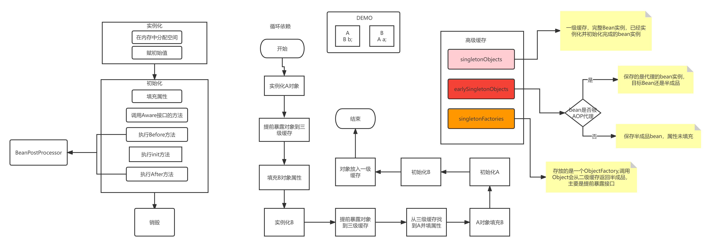
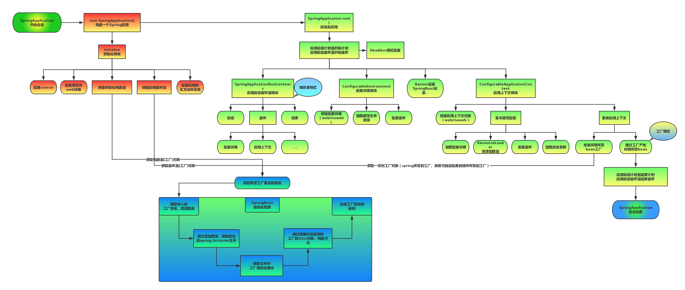

## SPRINGBOOT

### 1.注入bean有几种方式？

> 1.基于反射
>
>   构造器注入
>
>   setter注入
>
> 2.基于注解的注入
>
>   @Autowired  基于类型 来自Spring，结合@Qualifier可以byName
>
>   @Resource   基于名称 来自JDK

### 2.说说AOP和IOC？

> AOP是面向切面编程，基于JDK动态代理或者CGlib实现。
>
> 5种通知类型：
>
> 前置通知：Before
>
> 后置通知：AfterReturning
>
> 异常通知：AfterThrowing
>
> 最终通知：After
>
> 环绕通知：Around
>
> AOP的应用场景：
>
> 日志记录
>
> 异常处理
>
> 权限验证
>
> 事务处理
>
> 效率检查
>
> 缓存优化

### 3.SpringBoot的启动流程？

> 

### 4.SpringBoot是如何实现自动装配的？

> SpringBoot启动的时候通过@EnableAutoConfiguration注解找到META-INF/spring.factories配置文件中所有的自动配置类，并对其进行加载，而这些自动配置类的类名都是以AutoConfiguration结尾来命名的，它实际上就是一个javaConfig形式的Spring容器配置类，它们都有一个@EnableConfigurationPerperties的注解，通过这个注解启动XXXProperties命名的类去加载全局配置中的属性，如server.port,而XXXProperties通过@ConfigurationProperties注解将全局配置文件中的属性与自己的属性进行绑定。

### 5.Spring如何解决循环依赖的问题以及bean的生命周期？

### 6.SpringBoot配置的加载顺序？

### 7说说JDK动态代理和cglib?

> java动态代理是利用反射机制生成一个实现代理接口的匿名类，在调用具体方法前调用InvokeHandler来处理。
>
> 而cglib动态代理是利用asm开源包，对代理对象类的class文件加载进来，通过修改其字节码生成子类来处理。
>
> 1、如果目标对象实现了接口，默认情况下会采用JDK的动态代理实现AOP 
> 2、如果目标对象实现了接口，可以强制使用CGLIB实现AOP 
>
> 3、如果目标对象没有实现了接口，必须采用CGLIB库，spring会自动在JDK动态代理和CGLIB之间转换
>
> 如何强制使用CGLIB实现AOP？
>  （1）添加CGLIB库，SPRING_HOME/cglib/*.jar
>  （2）在spring配置文件中加入<aop:aspectj-autoproxy proxy-target-class="true"/>
>
> JDK动态代理和CGLIB字节码生成的区别？
>  （1）JDK动态代理只能对实现了接口的类生成代理，而不能针对类
>  （2）CGLIB是针对类实现代理，主要是对指定的类生成一个子类，覆盖其中的方法
>   因为是继承，所以该类或方法最好不要声明成final 

### 8.什么情况下，事务会失效？

> 1. 对象不是Spring管理的对象
> 2. 如使用mysql且引擎是MyISAM
> 3. 非public修饰的方法
> 4. 异常被catch住，但是没有抛出异常
> 5. 同一个类中，方法内调用
> 6. 使用多线程调用

### 9.BeanFactory和FactoryBean的异同点？

> 1.两者都是接口。
>
> 2.BeanFactory主要用来创建bean和获取bean。
>
> 3.FactoryBean和普通Bean不同，其返回的对象不是指定类的一个实例，而是FactoryBean的getObject方法所返回的对象。
>
> 4.通过BeanFactory和beanName获取bean时，如果beanName不加&,则获取到对应的Bean实例；如果加上&，则获取到FactoryBean本身的实例。

### 10.SpringBoot的核心注解？

> 启动类上面的注解是@SpringBootApplication，它也是SpringBoot的核心注解，主要组合包含了以下3个注解：
>
> **1、** @SpringBootConfiguration：组合了@Configuration注解，实现配置文件的功能。
>
> **2、** @EnableAutoConfiguration：打开自动配置的功能，也可以关闭某个自动配置的选项，如关闭数据源自动配置功能：SpringBootApplication(exclude={DataSourceAutoConfiguration.class})
>
> **3、** @ComponentScan：Spring组件扫描
