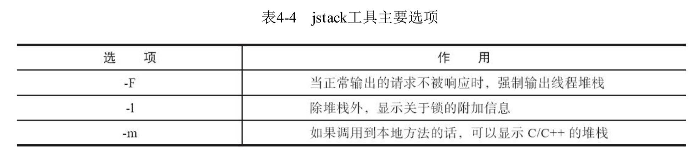

## JVM命令集合

### 1.分析类

| 命令                                | 表述                                                       |
| ----------------------------------- | ---------------------------------------------------------- |
| jstat -gcutil pid time              | 查看堆栈的垃圾收情况和内存使用情况                         |
| jmap -heap pid                      | 查看堆栈信息                                               |
| jinfo -flag xxx pid                 | 查看参数配置,xxx表示要看的某样参数。例如：SurvivorRatio    |
| jmap -clstats pid                   | 查看所有的类加载器                                         |
| top -p pid                          | 查看某个进程的内存cpu占用率                                |
| ps -mp pid -o THREAD,tid,time       | 查看某个进程内各个线程的CPU占用率和运行时间                |
| printf "%x\n" tid                   | tid线程ID，转换某个线程ID为16进制，当面jstack 命令         |
| jstack pid                          | 查看进程的堆栈信息                                         |
| jps -v                              | 查看进程JVM配置                                            |
| jstack -l pid \|grep nid -A100      | nid表示16进制的tid(线程ID)，-A表示继续看关键字后面的行数。 |
| jstack -l pid >> /path/file.log     | 把堆栈写如文件                                             |
| jmap -histo:live pid >jmap.txt      | 会强制GC                                                   |
| jmap -dump:format=b,file=/path/file |                                                            |

### 2.设置类

| 参数                             | 描述                                                         |
| -------------------------------- | ------------------------------------------------------------ |
| UseSerialGC                      | 虚拟机运行在Client模式下的默认值，打开此开关后，使用Serial+SerialOd的收集器组合进行内存回收 |
| UseParNewGC                      | 打开此开关后，使用ParNew+Serial Old的收集器组合进行内存回收，在JDK9后不再支持 |
| UseConcMarkSweepGC               | 打开此开关后，使用ParNew+CMS+Serial Old的收集器组合进行内存回收。Serial Old收集器将作为CMS收集器出现“Concurrent Mode Failure"失败后的后备收集器使用 |
| UseParallelGC                    | JDK9之前虚拟机运行在Server模式下的默认值，打开此开关后，使用Parallel Scavenge+Serial Old(PS MarkSweep)的收集器组合进行内存回收 |
| UseParallelOldGC                 | 打开此开关后，使用Parallel Scavenge+Parallel Old的收集器组合进行内存回收 |
| SurvivorRatio                    | 新生代中Eden区域与Survivor区域的容量比值，默认为&，代表Eden:Survivor=8:1 |
| PretenureSizeThreshold           | 直接晋升到老年代的对象大小，设置这个参数后，大于这个参数的对象将直接在老年代分配 |
| MaxTenuringThreshold             | 晋升到老年代的对象年龄。每个对象在坚持过一次Minor GC之后，年龄就增加1，当超过这个参数值时就进人老年代 |
| UseAdaptiveSizePolicy            | 动态调整Java堆中各个区域的大小以及进入老年代的年龄           |
| **HandlePromotionFailure**       | 是否允许分配担保失败，即老年代的剩余空间不足以应付新生代的整个Eden和Survivor区的所有对象都存活的极端情况 |
| ParallelGCThreads                | 设置并行GC时进行内存回收的线程数                             |
| GCTimeRatio                      | GC时间占总时间的比率，默认值为99，即允许1%的GC时间。仅在使用Parallel Scavenge收集器时生效 |
| MaxGCPauseMillis                 | 设置GC的最大停顿时间。仅在使用Parallel Scavenge收集器时生效  |
| CMSInitiatingOccupancyFraction   | 设置CMS收集器在老年代空间被使用多少后触发垃圾收集。默认值为68%,仅在使用CMS收集器时生效 |
| UseCMSCompactAtFullCollection    | 设置CMS收集器在完成垃圾收集后是否要进行一次内存碎片整理。仅在使用CMS收集器时生效，此参数从DK9开始废弃 |
| CMSFullGCsBeforeCompaction       | 设置CMS收集器在进行若干次垃圾收集后再启动一次内存碎片整理。仅在使用CMS收集器时生效，此参数从JDK9开始废弃 |
| UseG1GC                          | 使用G1收集器，这个是DK9后的Server模式默认值                  |
| G1HeapRegionSize=n               | 设置Region大小，并非最终值                                   |
| MaxGCPauseMillis                 | 设置G1收集过程目标时间.默认值是200ms,不是硬性条件            |
| G1NewSizePercent                 | 新生代最小值，默认值是5%                                     |
| G1MaxNewSizePercent              | 新生代最大值，默认值是60%                                    |
| ParallelGCThreads                | 用户线程冻结期间并行执行的收集器线程数                       |
| ConcGCThreads=n                  | 并发标记、并发整理的执行线程数，对不同的收集器，根据其能够并发的阶段，有不同的含义 |
| Initiating HeapOccupancy Percent | 设置触发标记周期的Java堆占用率阈值。默认值是45%。这里的java堆占比指的是non young capacity bytes,包括old+humongous |
| UseShenandoahGC                  | 使用Shenandoah收集器。这个选项在OracleJDK中不被支持，只能在OpenJDK 12或者某些支持Shenandoah的Backport发行版本使用。目前仍然要配合-XX:+UnlockExperimentalVMOptions使用 |
| ShenandoahGCHeuristics           | Shenandoah何时启动一次GC过程，其可选值有adaptive、static、compact、passive、aggressive |
| UseZGC                           | 使用ZGC收集器，目前仍然要配合-XX:+UnlockExperimentalVMOptions使用 |
| UseNUMA                          | 启用NUMA内存分配支持，目前只有Parallel和ZGC支持，以后G1收集器可能也会支持该选项 |

### 3.GC日志

| 简写       | 描述                           |
| ---------- | ------------------------------ |
| PSYoungGen | Parallel Scavenge+Parallel Old |
| DefNew     | Serial+Serial Old              |
| ParNew     | parNew+CMS                     |

### 4.查找问题分析工具

#### 4.1 jmap：Java内存映像工具

> jmap（Memory Map for Java）命令用于生成堆转储快照（一般称为heapdump或dump文件）。如 果不使用jmap命令，要想获取Java堆转储快照也还有一些比较“暴力”的手段：譬如在第2章中用过的XX：+HeapDumpOnOutOfMemoryError参数，可以让虚拟机在内存溢出异常出现之后自动生成堆转储 快照文件，通过-XX：+HeapDumpOnCtrlBreak参数则可以使用[Ctrl]+[Break]键让虚拟机生成堆转储快 照文件，又或者在Linux系统下通过Kill-3命令发送进程退出信号“恐吓”一下虚拟机，也能顺利拿到堆转
> 储快照。
>
> jmap的作用并不仅仅是为了获取堆转储快照，它还可以查询finalize执行队列、Java堆和方法区的 详细信息，如空间使用率、当前用的是哪种收集器等。

#### 4.2 jinfo:java配置信息工具

> jinfo（Configuration Info for Java）的作用是实时查看和调整虚拟机各项参数。使用jps命令的-v参 数可以查看虚拟机启动时显式指定的参数列表，但如果想知道未被显式指定的参数的系统默认值，除 了去找资料外，就只能使用jinfo的-flag选项进行查询了（如果只限于JDK 6或以上版本的话，使用javaXX：+PrintFlagsFinal查看参数默认值也是一个很好的选择）。jinfo还可以使用-sysprops选项把虚拟机把进程的System.getProperties()的内容打印出来。
>
> jinfo在运行期有修改部分参数值的能力（可以使用-flag[+|-]name或者-flag name=value在运行期修改一部分运行期可写的
> 虚拟机参数值）。

#### 4.3 jps:虚拟机进程状况工具

> 可以列出正在运行的虚拟机进 程，并显示虚拟机执行主类（Main Class，main()函数所在的类）名称以及这些进程的本地虚拟机唯一
> ID（LVMID，Local Virtual Machine Identifier）。

#### 4.4 jstat：虚拟机统计信息监视工具

> jstat（JVM Statistics Monitoring Tool）是用于监视虚拟机各种运行状态信息的命令行工具。它可 以显示本地或者远程虚拟机进程中的类加载、内存、垃圾收集、即时编译等运行时数据，在没有 GUI图形界面、只提供了纯文本控制台环境的服务器上，它将是运行期定位虚拟机性能问题的常用工具。

#### 4.5 jstack: java堆栈跟踪工具

> jstack（Stack Trace for Java）命令用于生成虚拟机当前时刻的线程快照（一般称为threaddump或者 javacore文件）。线程快照就是当前虚拟机内每一条线程正在执行的方法堆栈的集合，生成线程快照的 目的通常是定位线程出现长时间停顿的原因，如线程间死锁、死循环、请求外部资源导致的长时间挂 起等，都是导致线程长时间停顿的常见原因。线程出现停顿时通过jstack来查看各个线程的调用堆栈，
> 就可以获知没有响应的线程到底在后台做些什么事情，或者等待着什么资源。

