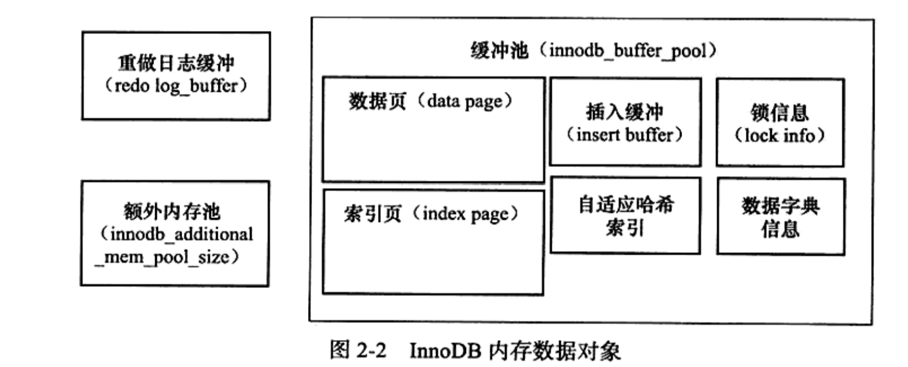

## Mysql

### 1. Mysql中有哪几种锁？

> 1.表级锁：开销小，加锁快；不会出现死锁；锁定粒度大，发生锁冲突的概率最高，并发度最低。
>
> 2.行级锁：开销大，加锁慢；会出现死锁；锁定粒度最小，发生锁冲突的概率最低，并发度也最高。
>
> 3.页面锁：开销和加锁时间界于表锁和行锁之间；会出现死锁；锁定粒度界于表锁和行锁之间，并发度一般。

### 2. Mysql中有哪些引擎？

> 1. MyISAM
> 2. Heap
> 3. Merge
> 4. INNODB
> 5. ISAM

### 3. 简述在Mysql数据库中MyISAM和InnoDB的区别?

#### 1.MyISAM：

> 不支持事务，但是每次查询都是原子的；
>
> 支持表级锁，即每次操作是对整个表加锁；
>
> 存储表的总行数；
>
> 一个MYISAM表有三个文件：索引文件、表结构文件、数据文件；
>
> 采用非聚集索引，索引文件的数据域存储指向数据文件的指针。辅索引与主索引基本一致，但是辅索引不用保证唯一性。

#### 2.InnoDB:

> 支持ACID的事务，支持事务的四种隔离级别；
>
> 支持行级锁及外键约束：因此可以支持写并发；
>
> 不存储总行数；
>
> 一个InnoDB引擎存储在一个文件空间（共享表空间，表大小不受操作系统控制，一个表可能分布在多个文件里），也有可能为多个（设置为独立表空，表大小受操作系统文件大小限制，一般为2G）；
>
> 主键索引采用聚集索引（索引的数据与存储数据文件本身），辅助索引的数据存储主键的值；因此从辅索引查找数据，需要先通过辅索引找到主键值，再访问辅索引；最好使用自增主键，防止插入数据时，为维持B+树结构，文件的大调整。

### 3.什么是聚簇索引？什么是非聚簇索引？

> 聚簇索引的叶子点中保存了完整的行记录。InnoDB中每个表都必须有一个聚簇索引，默认根据主键建立，如果表中没有主键，InnoDB会选择一个合适的列未聚簇索引，如果找不到合适的列，会使用一条隐藏的列DB_ROW_ID作为聚簇索引。
>
> 非聚簇索引的叶子点保存了主键和索引字段的值，所过查询的是索引字段，或者是主键，则不用回表查询，如果是查询其他列数据，则需要回表查询。

### 4. 列设置为AUTO INCREMENT时，如果在表中达到最大值，会发生什么情况？

> 它会停止递增，任何进一步的插入都将产生错误，因为主键冲突。

### 5. 什么是分库分表？为什么有时候需要分库分表？

### 6. 水平拆分和垂直拆分如何判断，举个例子？

### 7. InnoDB中有哪几种隔离级别？

| 事务隔离级别                                | 脏读 | 不可重复读 | 幻读 |
| ------------------------------------------- | ---- | ---------- | ---- |
| 读未提交（read-uncommitted）                | 是   | 是         | 是   |
| 不可重复读（read-committed）**ORACLE默认**  | 否   | 是         | 是   |
| 可重复读（repeatable-read）   **MYSQL默认** | 否   | 否         | 是   |
| 串行化（serializable）                      | 否   | 否         | 否   |

### 8.  可以使用多少列创建索引？

> 任何标准表最多可以创建16个索引列。

### 9.索引的底层实现原理和优化

> B+树，经过优化的B树
>
> 主要是在所有的叶子结点中增加了指向下一个叶子节点的指针，因此InnoDB建议为大部分表使用默认自增的主键作为主索引。
>
> B+树，也叫多路搜索树，每个节点可以存储一个innoDB页的数据，每页是16KB,对于聚簇索引树来说，每个节点存储的是聚簇索引，每个索引又指向子节点，这样可以大大减少查找的次数，而且子节点的数据是横向是链表结构，适合范围查找。

### 10.索引什么时候会失效

> 1. 如果列类型是字符串，那一定要在条件中将数据使用引号引用起来,否则不使用索引。
> 2. like查询以%开头。
> 3. 对于联合索引，要符合最左前缀原则，否者不使用索引。
> 4. 如果mysql估计使用全表扫描要比使用索引快,则不使用索引，比如性别字段。

### 11.Mysql的MVCC

### 12.Mysql的主从复制原理

### 13.innodb底层细节

#### 13.1 indoDB内存数据对象

#### 13.2 innodb的LRU算法

> 数据库中是使用LRU算法对缓存池进行管理，即最近最少使用的放在LRU末端，最频繁使用的页放在LRU列表的前端，当缓存池不能存放新读取的页时，将首先释放LRU列表中尾端的页。

###### innodb对LRU算法做的优化：

> 在innoDB中，缓缓冲池的页大小默认时16KB，

#### 14 MySql有哪些日志

> 1. binlog
> 2. undolog
> 3. redolog