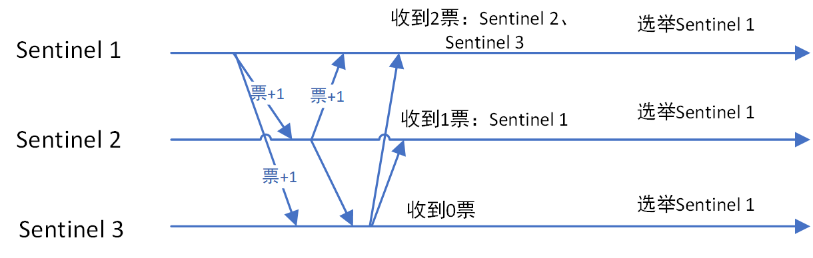

## REDIS

### 1.REDIS为什么快？

> 1.基于内存
>
> 2.底层优秀的设计结构
>
> 3.IO多路复用

### 2.什么是IO多路复用？

> 多路复用是指以同一传输媒质（线路）承载多路信号进行通信的方式。在liunx中，一切皆文件，每个socket也对应一个相应的文件描述符，所有的文件描述符封装在一个列表中，其实就是用一个线程或进程来监视多个文件描述符。
>
> redis其实是封装了4中模式，select、poll、kqueue,epoll,因为redis是多平台的，会根据不同的平台选择不同的模式，在Linux使用的就是epoll。
>
> select模式一共只能监视1024个文件描述符，使用轮训的机制查看文件描述符的状态，epoll比较优秀的是没有1024的限制，并且是事件驱动，当某个FD准备好了之后会触发时间，epoll返回用户的也是准备好的FD，不需要再去遍历，而且数据结构上用了红黑树和链表。这部分是放在内核和用户共用的部分，不用再从用户态到内核态的文件复制。

### 3.REDIS有哪些数据类型，底层数据结构是什么？

#### 3.1 重要配置项

```java
hash-max-ziplist-entries 512
hash-max-ziplist-value 64
```


#### 3.2 简单动态字符串SDS 

> String类型的底层


> 1. 常数复杂度获取常数
>
>    因为本身记录了字符串的长度，所以直接根据len去取就行
>
> 2. 杜绝缓存池溢出
>
>    redis采用空间预分配策略，因为本身记录free，如果free不够添加字符串，则会扩展，不但会分配所必要的空间，还会分配额外的未使用空间
>
>    1. 对SDS修改之后，sds的len长度小于1M的时候，程序会分配和len同样大小的空间，如果大于1M，则分配1M的额外空间。
>    2. 惰性空间释放。
>
> 3. 减少内存分配次数
>
>    原因与2相同
>
> 4. 二进制安全
>
>    C是扫描一个特定的字符串，而Redis由len记录，这样就能保证redis可以存二进制数据，不用担心特殊字符带来的影响。

#### 3.3 链表

> **list**的底层实现之一
>
> 1. 双端
> 2. 无环
> 3. 带表头指针和表尾指针
> 4. 带链表长度计数器
> 5. 多态保证存储各种类型的值。


#### 3.4 字典

> **hash**和**set**的底层实现之一


##### 3.4.1 扩容和缩容

> 扩容：跟hashMap不一样的时，字段允许元素数量大于表的容量，即used可以大于size，当下列条件之一满足时，程序会自动扩容
>
> 1. 服务器目前没有在执行BGSAVE命令或者BGREWATINGAOF命令，并且hash表的负载因子大于1的时候。
> 2. 服务器正在执行BGSAVE命令或者BGREWATINGAOF命令，并且hash表的负载因子大于5的时候
>
> 缩容：
>
> 1. 当负载因子小于0.1的时候会进行缩容。
>
> 过程：
>
> 1. 把ht[0]的数据放在h[1]里面，完全放完后，将h[0]释放，将h[1]设置为h[0]，再h[1]新建一个空白的hash表。
> 2. rehash是渐进式的，如果数量少，可能一次就完了，如果数量庞大会分多次完成。
>
> 扩容和缩容空间分配：
>
> 1. 扩展操作，那么h[1]的大小为第一个大于等于used*2的2的n次幂；
>
>    比如used=3，3*2=6，2的3次幂是8，那么8就是h[1]的size。
>
> 2. 缩容操作，那么h[1]的大小是第一个大于等于used的2的n次幂；
>
>    比如used=3，2的2次幂等于4，那么4就是h[1]的size。

```java
//负载因子
load_factor = ht[0].used / ht[0].size
```

##### 3.4.2 hash冲突

> 和hashMap类似，先计算hash值，如果冲突就采用头插法插入链表，因为是单线程，所以不会有HashMap

#### 3.5 zipList压缩列表

> 压缩列表是**list**和**hash**还有**zset**的底层实现之一，当一个list只有少量数据并且每个列表项都是小整数值，或者是长度比较短的字符串，那么redis就会使用压缩列表来作为底层实现。


> 压缩列表并非为了速度而设计，实际上恰恰相反，还有对性能有所影响，因为没有前后指针，压缩列表的设计是为了最大节省内存。

#### 3.6 整数集合

> 整数intset是**set**的底层实现之一。当一个集合只包含整数的时候，redis就会用intset作为底层实现。


> intset只能升级不能降级。

#### 3.7 跳表

> 跳表是一种有序的数据结构，效率与平衡树想媲美是**zset**的底层实现之一。


### 4.什么是缓存穿透，缓存击穿，缓存雪崩?如何解决？

#### 4.1 缓存穿透

> 缓存穿透是缓存和数据库都不存在数据，而用户不断发起请求，大流量时对于不存在的key频繁访问就给数据库造成了很大的压力，有可能使数据库宕机。
>
> 解决方案：
>
> 1. 接口层增加校验，风控系统限制用户IP
> 2. 使用布隆过滤器

#### 4.2 缓存击穿

> 缓存击穿是缓存中没有数据，数据库有数据，一般都是Key过期了，但这个时候这个key瞬时被大批量访问，把压力带给数据库。
>
> 解决方案：
>
> 1. 加互斥锁，访问缓存不加锁，访问数据库加锁，第一个线程访问完数据库之后，要写入缓存，其他线程就可以继续访问缓存了
> 2. 设置热点数据不过期，这个很难，因为很难判断什么是热点数据。

#### 4.3 缓存雪崩

> 大面积的key同时过期，流量从而进入数据库。
>
> 解决方案：
>
> 1. 随机设置缓存失效时间，避免key同时到期
> 2. 不设置过期时间
> 3. 定时任务，在缓存失效期刷新缓存。

### 5.REDIS如何保证高可用?

#### 5.1 主从复制

> Redis全量复制一般发生在Slave初始化阶段，这时Slave需要将Master上的所有数据都复制一份。具体步骤如下： 
> \- 从服务器连接主服务器，发送SYNC命令； 
> \- 主服务器接收到SYNC命名后，开始执行BGSAVE命令生成RDB文件并使用缓冲区记录此后执行的所有写命令； 
> \- 主服务器BGSAVE执行完后，向所有从服务器发送快照文件，并在发送期间继续记录被执行的写命令； 
> \- 从服务器收到快照文件后丢弃所有旧数据，载入收到的快照； 
> \- 主服务器快照发送完毕后开始向从服务器发送缓冲区中的写命令； 
> \- 从服务器完成对快照的载入，开始接收命令请求，并执行来自主服务器缓冲区的写命令；


#### 5.2 集群搭建

> 可以搭建集群，当一台挂了的时候，会进行选举，在从服务器中选出一台主服务器。
>
> 横向扩展：
>
> 多主多从，每个主保存的数据不一样，一共16384个slot，这样可以增加并发量，设计比较难，如果增删节点比较复杂。

### 6.REDIS如何持久化？

> AOF和RDB
>
> AOF命令的集合，达到上限后会瘦身，即生成新的aof文件，把能合并的命令都合并了，优点就是保存数据多，缺点恢复慢，得一条条执行指令。
>
> RDB是快照文件，相比于AOF来说不会那么频繁的写入，导致服务器宕机的时候，可能损失比较多的数据，但是恢复会很快。

### 7.REDIS的数据类型底层转换

#### 7.1 String

| 值                           | 编码类型                 |
| ---------------------------- | ------------------------ |
| 整数                         | int                      |
| 字符串，长度小于等于44字节时 | embstr(分配一次内存) SDS |
| 字符串，长度大于44个字节时   | raw(分配两次内存) SDS    |

#### 7.2 list

| 值                                                      | 编码类型   |
| ------------------------------------------------------- | ---------- |
| 元素长度小于等于64字节并且元素个数小于等于512个(可配置) | zipList    |
| 元素长度大于64字节或者元素个数大于512个(可配置)         | linkedList |

#### 7.3 hash

| 值                                                           | 编码类型        |
| ------------------------------------------------------------ | --------------- |
| 每个键值对的键和值的长度均小于等于64个字节并且键值对数量小于等于512个（可配置） | ziplist         |
| 键值对的键或者值的长度大于64个自己或者键值对个数大于512个    | hashtable(字典) |

#### 7.4 set

| 值                                                        | 编码类型                             |
| --------------------------------------------------------- | ------------------------------------ |
| 集合对象元素都是整数，并且元素数量小于等于512个（可配置） | intset                               |
| 集合对象元素有字符串或者元素数量大于512个                 | hashtable(key为set的值，value为null) |

#### 7.5 Sort Set

| 值                                                      | 编码类型                                                     |
| ------------------------------------------------------- | ------------------------------------------------------------ |
| 元素小于等于128个并且元素长度小于等于64个字节（可配置） | zipList                                                      |
| 元素大于128和或者元素长度大于64个字节                   | skipList+dict（key是成员value是分值，主要用于获取给定成员的分支ZSCORE） |

#### 7.6 总结


### 8.redis的使用场景？

> 1. 存储热点数据，减少对数据库的访问
> 2. 分布式锁
> 3. 用户cookie做单点登录
> 4. 排行榜
> 4. 数据库自增ID

### 9.redis的最大程度的利用？

##### 9.1不花钱：

> 1.从配置层面：比如开启压缩列表，能节约大概18个字节的空间。压缩列表会对数据进行解码和编码，如果列表长度太长的话，那么进行查询或插入的时候，会造成特别大的性能损耗。
>
> 2.代码层面：尽量简化redis的key,只要唯一又能保证我们业务正确的话就可以。
>
> 3.利用字典，如果有比较通用的数据，可以使用索引

9.2花钱：

> 2.增加redis数量，采用多主多从的集群模式，其实就是用钱换空间。缺点就是成本比较大，无论是金钱的投入还是管理的投入都会比较大。

### 10.redis的选举和故障转移

#### 10.1 哨兵集群选举

> 当redis哨兵集群的主节点出现故障的时候，Sentinel集群会从从节点中选出一个新节点。

##### 10.1.1 主管下线

> Sentinel每一个节点都会定时对redis集群中的所有节点发心跳包，检测节点是否正常，如果再down-after-millisecond时间内没有回复Sentinel的心跳包，则该redis节点会被该Sentinel节点认为主观下线。

##### 10.1.2 客观下线

> 当节点被一个Sentinel节点标记为主管下线时，并不意味着该节点一定出故障了，还需要Sentinel集群中其他Sentinel节点共同判断为主观下线才行。
>
> 该Sentinel节点会询问其他Sentinel节点，只有超过quonum数量的Sentinel节点认为该redis节点主观下线，那么这个redis节点就被客观下线了，如果此redis节点是从节点，那么就到此为止，如果是主节点，那么接下来就会从从节点选举并进行故障转移。

##### 10.1.3 Sentinel集群选举leader

> Sentinel使用raft算法，每一个Sentinel节点都可以成为Leader，当一个Sentinel节点确认redis集群的主节点主观下线后，会请求其他Sentinel节点要求将自己选举为Leader。被请求的Sentinel节点如果没有同意过其他Sentinel节点的选举请求，则同意该请求(选举票数+1)，否则不同意。
>
> 如果一个Sentinel节点获得的选举票数达到Leader最低票数(`quorum`和`Sentinel节点数/2+1`的最大值)，则该Sentinel节点选举为Leader；否则重新进行选举。



##### 10.1.4 Sentinel leader决定主节点

> 1. 过滤故障的节点。
> 2. 选择优先级slave-priority最大的节点为为主节点，不存在就继续
> 3. 选择数据偏移量最大的从节点为主节点，不存在就继续
> 4. 选择runid（每次redis启动的时候生成随机的runid作为服务器的标识）最小的从节点作为主节点。


#### 10.2 cluster多主多重集群选举

> 也是分为主观下线和客观下线，只不过是redis节点发现，因为没有Sentinel节点。
>
> 选举由各个Master节点选举，通过raft算法。