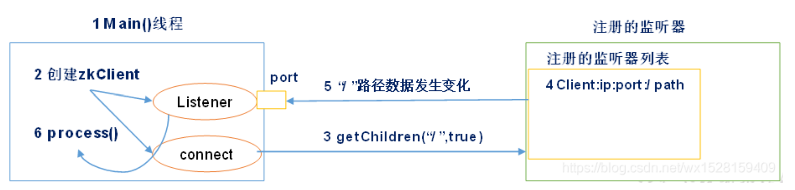

## zookeeper

### 1.选举

> zookeeper使用paxos算法，选举必须获得大于一半的投票才能成为领导者。

#### 1.1 首次选举

> 目前有5台服务器，编号一次是1-5，按编号以此启动zookeeper服务器。
>
> 1. 服务器1启动，首先给自己投票，对集群中启动的其他zookeeper服务器发起投票对比，此时其他服务器都没有启动，服务器1的状态为LOOKING。
> 2. 服务器2启动，首先给自己投票，对集群中启动的其他zookeeper服务器发起投票对比，此时和服务器1交换结果，服务器2的编号大，胜出，服务器1会给服务器2投票，服务器2此时拥有两票，但是仍然小于半数，所以服务器2此时状态为LOOKING。
> 3. 服务器3启动，首先给自己投票，对集群中启动的其他zookeeper服务器发起投票对比，此时和服务器1和服务器2交换结果，因为服务器3编号最大，所以胜出，得到两票，加上自己的1票一共3票，大于半数机器，成为领导者leader。服务器1和服务器2成为跟随者。
> 4. 服务器4启动，发现已经有leader，则自己成为跟随者。
> 5. 服务器5启动，同服务器4一样成为跟随者。

#### 1.2 非首次选举

> 对于正常运行的zookeeper集群，一旦中途有服务器宕机，则需要重新选举，选举的过程需要引入服务器ID，数据ID和逻辑时钟。这是由于zookeeper集群已经运行了一段时间，服务器中会存在数据。
>
> 1. 首先统计逻辑时钟是否相同，逻辑时钟（纪元、任期）小，则说明途中可能存在宕机问题，因此数据不完整，那么该选举结果被忽略，重新投票选举。
> 2. 其次，统一逻辑时钟后，对比数据ID值，数据ID反应数据的新旧程度，因此数据ID大的胜出。
> 3. 如果数据ID相同和逻辑时钟相同的情况下，对比服务器ID，值大者胜出。

#### 1.3 zookeeper角色

| 角色     | 说明                     |
| -------- | ------------------------ |
| leader   | 领导者                   |
| follower | 跟随者                   |
| looking  | 观察中                   |
| observer | 不参与选举投票的follower |

### 2.监听机制

> （1）在Zookeeper的API操作中，创建main()主方法即主线程；
>
> （2）在main线程中创建Zookeeper客户端（zkClient），这时会创建两个线程：
>
> ​         线程connet负责网络通信连接，连接服务器；
>
> ​         线程Listener负责监听；
>
> （3）客户端通过connet线程连接服务器；
>
> ​         图中getChildren("/" , true) ，" / "表示监听的是根目录，true表示监听，不监听用false
>
> （4）在Zookeeper的注册监听列表中将注册的监听事件添加到列表中，表示这个服务器中的/path，即根目录这个路径被客户端监听了；
>
> （5）一旦被监听的服务器根目录下，数据或路径发生改变，Zookeeper就会将这个消息发送给Listener线程；
>
> （6）Listener线程内部调用process方法，采取相应的措施，例如更新服务器列表等。