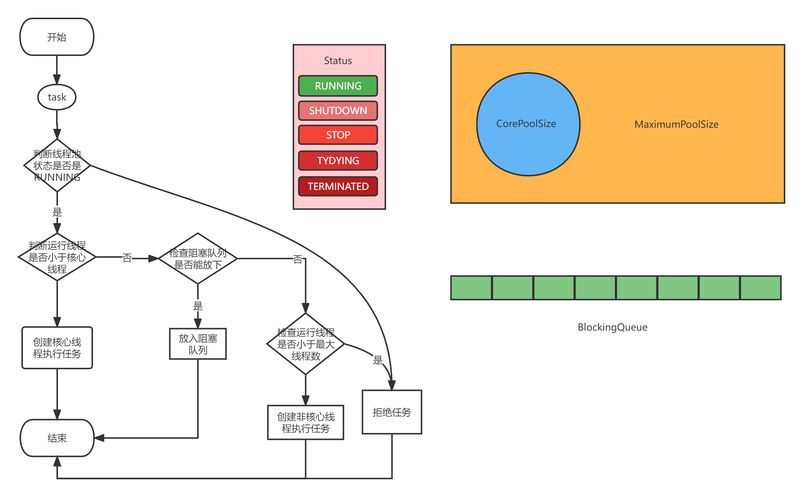

## 多线程

### 1. 进程和线程的区别是什么？

> 1. 进程是分配资源的基本单位
>
> 2. 线程是进程执行的基本单位

### 2. 并发和并行的区别？

> 1. 并行
>
> 多个处理器或者多核处理器同时执行不同的任务，是逻辑上的同时发生。
>
> 2. 并发
>
> 是一个处理器或者一个核心同时处理多个任务。是物理上的同时发生。

### 3. 线程间如何通信的？

> 1.使用Object的wait()和notify();

### 4. 线程的几种实现方式？

> 1.实现Runnable接口
>
> 2.继承Thread类
>
> 3.实现Callable接口
>
> 其他说明：
>
> Callable的call方法有返回值并且可以抛异常，而Runnable的run方法就没有返回值也没有抛异常。
>
> Callable运行后可以拿到一个Future对象，这个对象表示异步计算结果，可以从通过Future的get方法获取到call方法返回的结果。但要注意调用Future的get方法时，当前线程会阻塞，直到call方法返回结果。
>
> Runnable是作为线程的构造参数运行的，Callable是作为线程池的submit方法的参数运行的。

### 5. 线程的生命周期？

> 新建、就绪、运行、阻塞、销毁
>
> - 新建：就是刚使用new方法，new出来的线程；
> - 就绪：就是调用的线程的start()方法后，这时候线程处于等待CPU分配资源阶段，谁先抢的CPU资源，谁开始执行;
> - 运行：当就绪的线程被调度并获得CPU资源时，便进入运行状态，run方法定义了线程的操作和功能;
> - 阻塞：在运行状态的时候，可能因为某些原因导致运行状态的线程变成了阻塞状态，比如sleep()、wait()之后线程就处于了阻塞状态，这个时候需要其他机制将处于阻塞状态的线程唤醒，比如调用notify或者notifyAll()方法。唤醒的线程不会立刻执行run方法，它们要再次等待CPU分配资源进入运行状态;
> - 销毁：如果线程正常执行完毕后或线程被提前强制性的终止或出现异常导致结束，那么线程就要被销毁，释放资源;

### 6. 为什么阿里手册上建议手动建立线程池？

> 因为默认的可能会产生性能问题或者出现异常。
>
> 比如cacheThreadPool最大线程数是Integer最大值，过多的线程会导致CPU频繁的进行上下文切换。导致CPU标高。
>
> 比如FixThreadPool和SingleThreadPool队列最大长度是Integer最大值，可能会堆积大量请求，占用内存过多。出现OOM。

### 7.线程池的工作原理？

#### 7.1 线程池的参数

> corePoolSize 核心线程数

> maximumPoolSize 最大线程数

> long keepAliveTime, TimeUnit unit 空闲线程存活时间

> BlockingQueue<Runnable> workQueue 阻塞队列，等待执行的线程所放的队列

> ThreadFactory threadFactory 线程工厂，主要作用是为线程命名，以及创建线程的方式，比如设置优先级或者守护线程

> RejectedExecutionHandler handler 拒绝策略，当线程池都满了的时候，如何拒绝

| 模式                | 说明                     |
| ------------------- | ------------------------ |
| AbortPolicy         | 丢弃任务，抛出异常(默认) |
| CallerRunsPolicy    | 当前线程执行此任务       |
| DiscardPolicy       | 静默丢弃                 |
| DiscardOldestPolicy | 静默丢弃最老的任务       |

### 8.什么情况下适合使用线程池？

> 1.并行任务比较多时，如果串行执行，花费时间比较长，并行可以缩短时间，给用户最快的相应速度。
>
> 2.定时任务，定时处理批量任务的时候。可以合理是利用CPU。